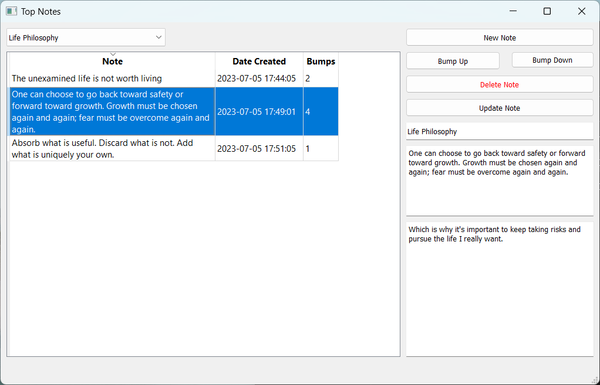

# Top Notes idea/note tracking application

Top-Notes is a simple note-storage application that also lets you add some extra detail to your notes and keep track of how you score said notes, making it easier to keep track of which notes you have found most useful for yourself in the long term.

The notes are stored in `~\Documents\top-notes\notes.db`

To create a shortcut in Windows:
1. make sure its `Start in` field corresponds to your Top-Notes folder
2. Set the `Target` field to `C:\Windows\pyw.exe main.py`